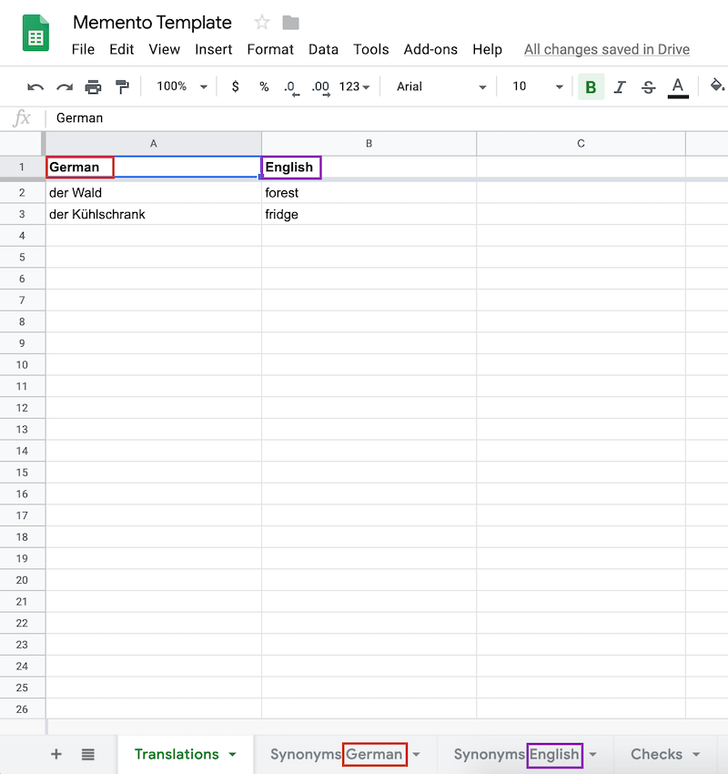

# Memento
*A console vocabulary trainer backed by Google Sheets.*

## How to use Memento
### Prepare a Google Sheet
Copy over the [Memento Template Sheet](https://docs.google.com/spreadsheets/d/11jhp4ZTuTPiLq96-6B5mrYS7s6xreUbbG2ildANPuJU/edit?usp=sharing)
to your account. The sheet has four tabs:

1. Translations: Put the translations you want to memorize here.
2. Synonyms German: For German synonyms
3. Synonyms English: For English synonyms
4. Checks: Memento will store the results of your training here. This is the only tab where Memento will write to.

Now adapt the language name headers according to your needs, and make sure that the names of the synonym tabs are properly synchronized. That is,
if one of your languages is 'French', than you should have a tab named 'Synonyms French', as illustrated by the image below:



Last but not least, enter some vocabulary and eventually synonyms, and feel free to change the title of the sheet
to whatever you want.

### Enable the Google Sheets API
Go to [https://developers.google.com/sheets/api/quickstart/java]() and scroll down to the blue button
'ENABLE TO GOOGLE SHEETS API'. In the resulting dialog, click 'DOWNLOAD CLIENT CONFIGURATION', and safe
it under `memento-gsheets-credentials.json`. 

### Install and configure Memento
Download Memento, and create a launch script like this:

```bash
#!/bin/bash

export SHEET_ID=put-your-sheet-id-here
export GOOGLE_CREDENTIALS_PATH=put-your-credentials-path-here
./memento-0.1.0
```

You can find the sheet ID of your Google Sheet by opening the sheet in your browser and inspecting the URL.
Make the script executable, and launch Memento.